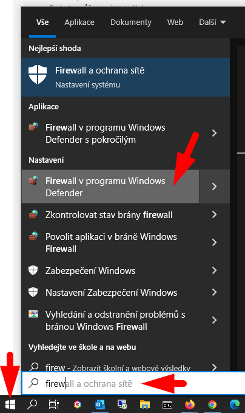
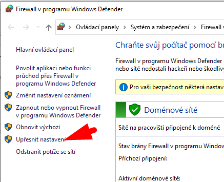
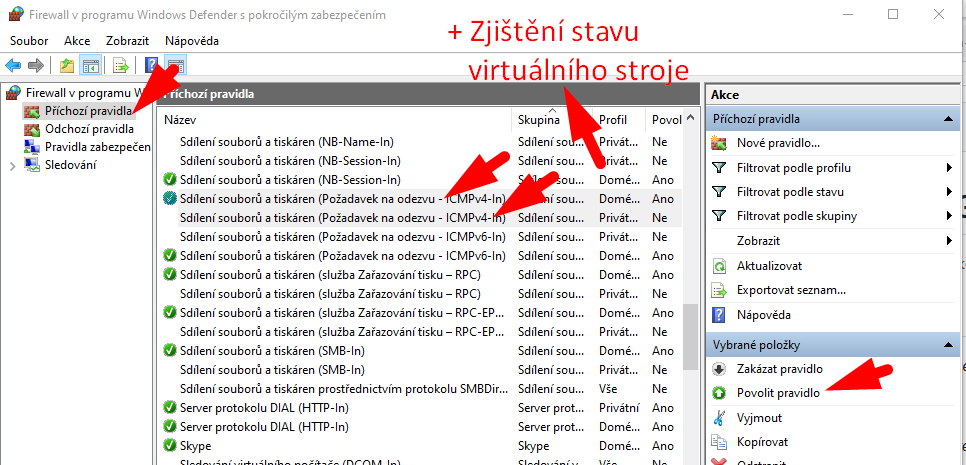

# Povolení služby „PING“ ve firewallu

> Poznámka: Jedná se o službu _echo_ protokolu ICMP. Lidově se nazývá „PING“.

> **Pokud PING zlobí, můžete zkusit dočasně zakázat firewall!** Až opravíte nastavení a až bude „PING“ fungovat bez firewallu, firewall znovu povolte.

## Postup (česká Windows):
1. _Start_ → _Firewall v programu Windows Defender_
2. _Upřesnit nastavení_
3. _Příchozí pravidla_
4. Povolte pro všechny typy sítí pravidla: 
    - _Sdílení souborů a tiskáren (Požadavek na odezvu - ICMPv4-In)_
    - _Zjištění stavu virtuálního stroje (Požadavek na odezvu - ICMPv4-In)_
5. Vpravo zelená šipka „Povolit pravidlo“

Postup (screenshoty):
1.  
2.  
3.  

## Postup (anglická Windows):
1. _Start_ → _Firewall v programu Windows Defender_
2. _Advanced Settings_ → _Inbound rules_
3. Povolte pro všechny typy sítí pravidla: 
    - _File and Printer Sharing (Echo Request - ICMPv4-In)_
    - _... (Echo Request - ICMPv4-In)_
4. Vpravo zelená šipka „Povolit pravidlo“
