# Vytvoření nového virtuálního stroje pro předmět POS

1. Vytvoř nový virtuální stroj&nbsp;   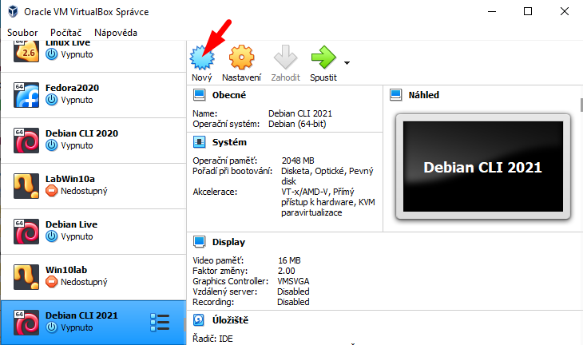
1. Přepnutí do _expertního režimu_ &nbsp;   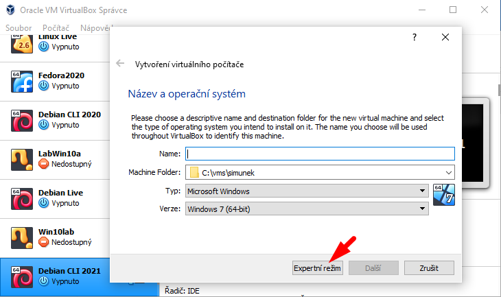
1. Zadej nastavení virtuálního stroje: &nbsp;   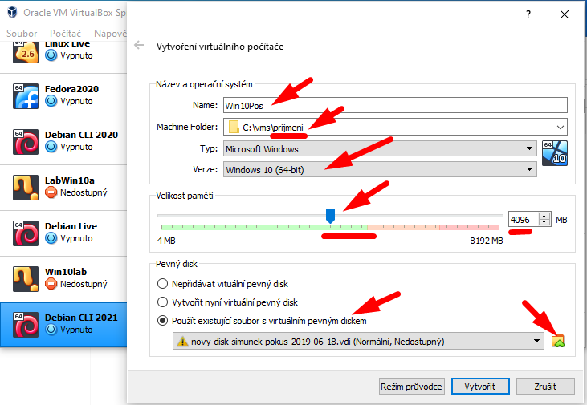
    - Název stroje je pro tebe, na ven vidět nejde.
    - Umístění souborů stroje bude `C:\vms\prijmeni`. Zkontroluj, že na `C:\` je složka `vms`. Další složky se vytvoří samy.
    - Disk obsahuje instalaci 64bitových Windows 10.
    - Velikost paměti by měla být nejlépe aspoň 4&nbsp;GB, ale není doporučeno přiřazovat stroji více než polovinu kapacity skutečné paměti (jezdec by měl být v&nbsp;zelené zóně).
1. K&nbsp;virtuálnímu stroji připojíme připravený virtuální disk stažený na `D:\win10lab.vdi`: 
    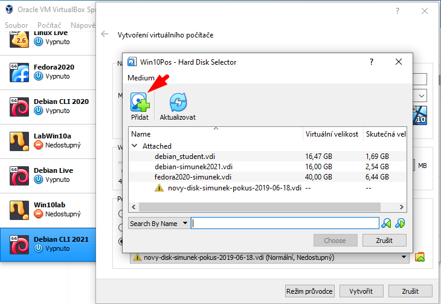
     
    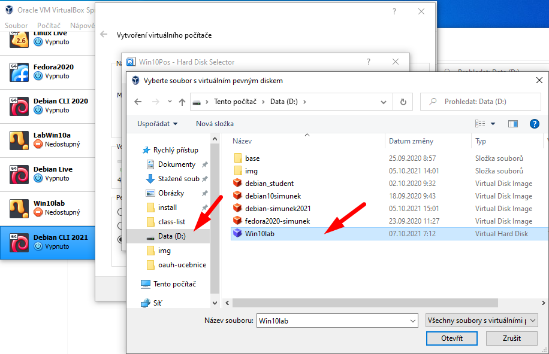
1. Pokud na tvém počítači chybí soubor `D:\win10lab.vdi`, nebo je poškozený, zkopíruj si ho ze serveru `\\dilna`:
     
     **POZOR!!! Nepřipojuj soubor ze serveru, zkopíruj si ho na `D:`!!!**
     
       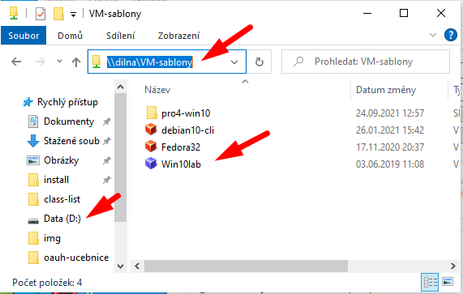
1. Potvrď připojení virtuálního disku:  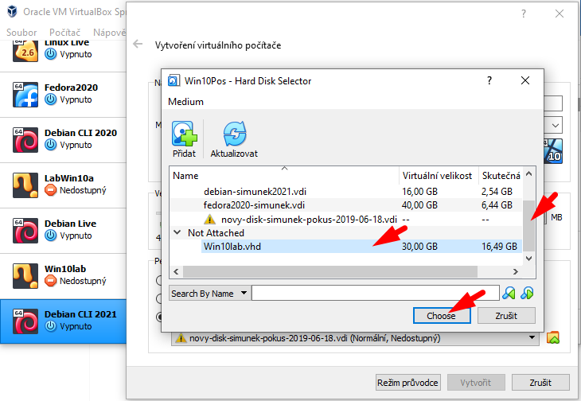
1. Vytvoř stroj:  
1. Nastavení síťového mostu 
Aby počítač mohl komunikovat ve cvičné síti, je třeba ho přepnout do režimu _síťový most_! 
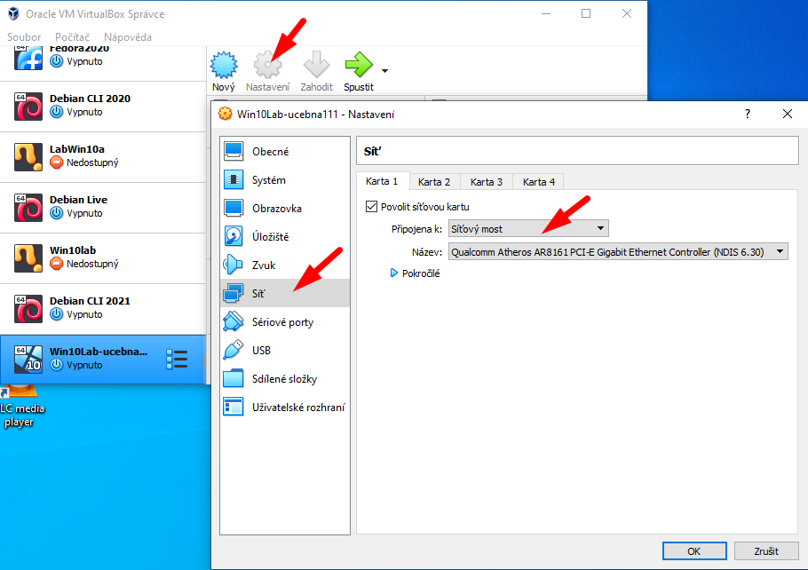
1. Doporučené nastavení: přiřazení více jader procesoru  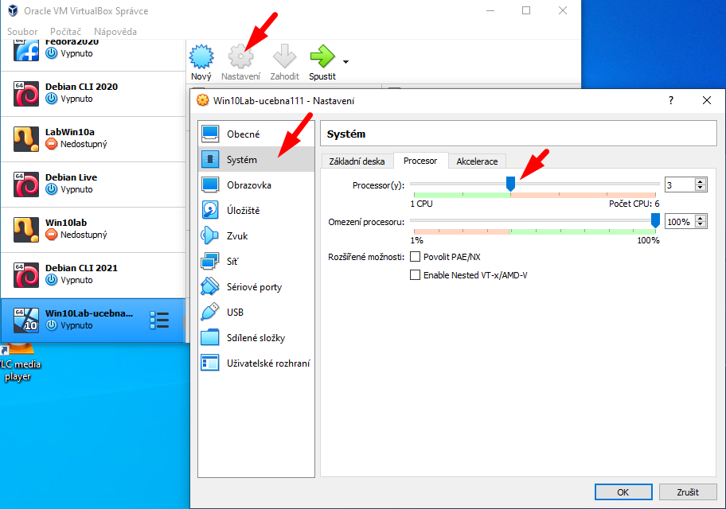

> **Přepoj počítač ze školní do cvičné sítě!!**
>
> Před spuštěním virtuálního stroje je třeba **přepnout počítač do cvičné sítě!!!**
> Přepoj UTP kabel do správného konektoru cvičné školní sítě!

1. Spusť virtuální stroj tlačítkem _Spustit_  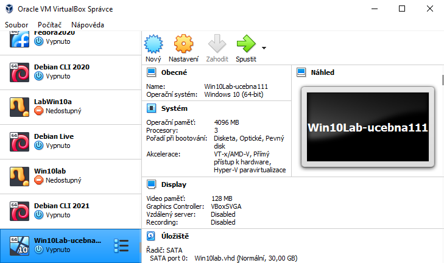
1. Dodatečné přepnutí síťového stroje při spuštěném stroji:   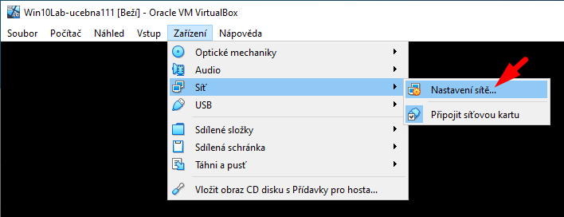
1. Volitelně: přepnutí do celoobrazovkového režimu:   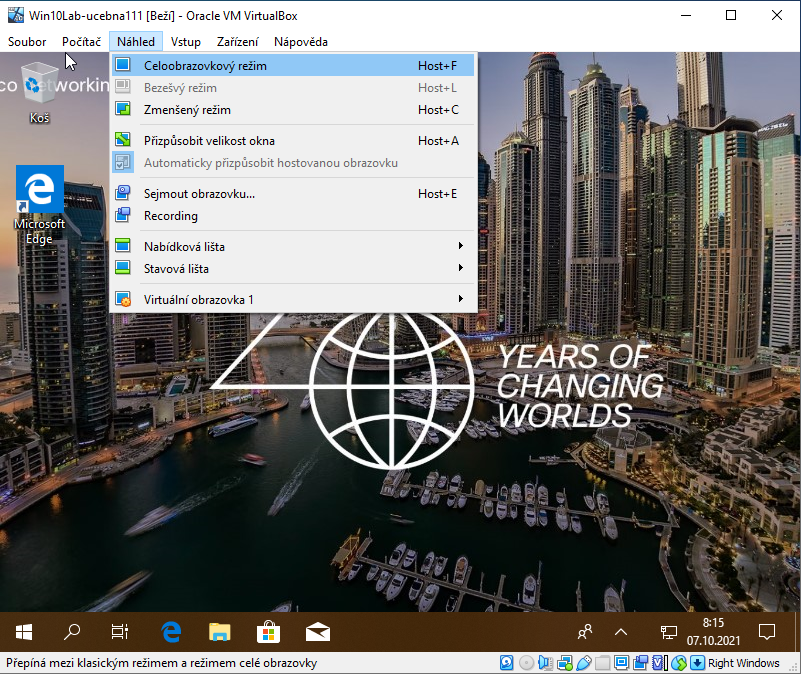